# Manual de Configuracion Eventos

CONFIGURACION DE VARIAS CADENAS EN UN SERVIDOR

## 1 Creación de carpetas en el servidor

Para la creación de varios sitios basta con renombrar con el nombre de la cadena al sitio POS, a continuación un ejemplo de configuración de 6 cadenas en el mismo servidor

 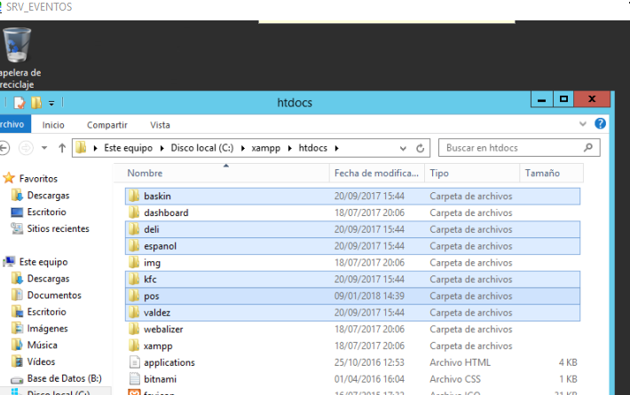

## 2 Cambio en cada uno de los sitios de las cadenas

### 2.1 Configuraciones de Politicas

Debemos configurar accediendo a cada uno de los sitios la política a nivel de restaurante que se llama SITIO MAXPOINT

 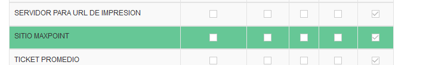

Debemos revisar que esta política tengo configurado el Parámetro Nombre
 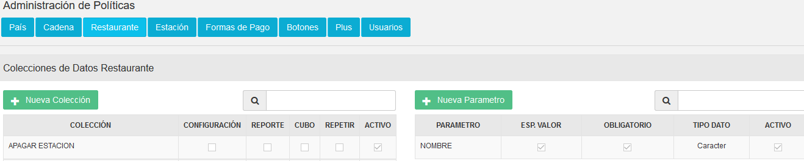

 ### 2.2 Configuraciones en Restaurante

Debemos realizar la configuración en el restaurante para poder colocar el nombre del sitio configurado en el servidor
 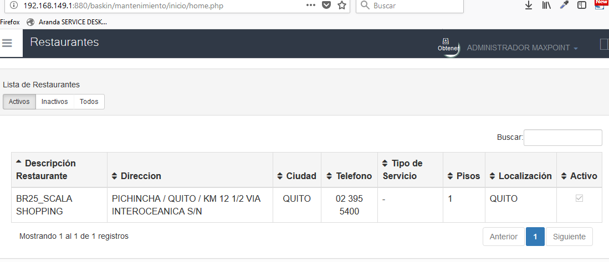

Seleccionamos políticas de configuración
 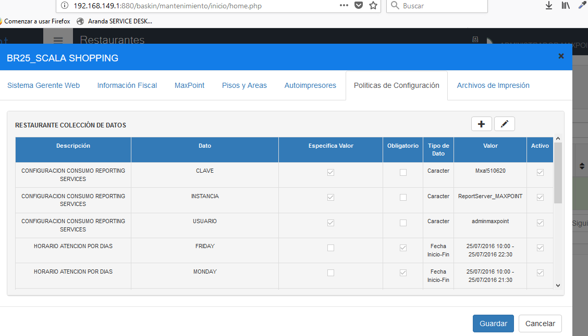

 

 A continuación, agregamos la política de SITIO MAXPOINT y colocamos el nombre de la carpeta correspondiente:
  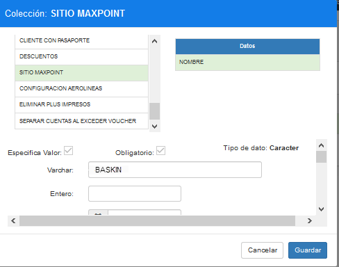

Además, debemos cambiar la política de SERVIDOR PARA URL DE IMPRESIÓN
 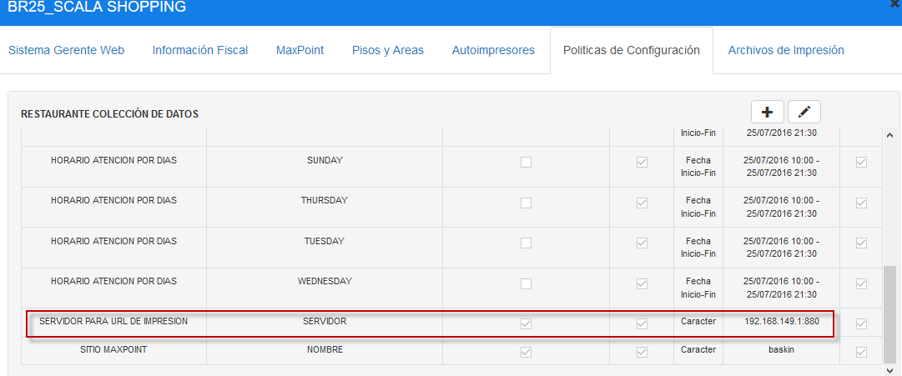

 ### 2.3 Configuraciones de Tipo de Facturación

A continuamos vamos al menú y ubicamos la pantalla de Tipo de Facturación

 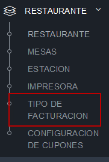

Luego cambiamos el registro PLAN MARKET como muestra la imagen a continuación:
 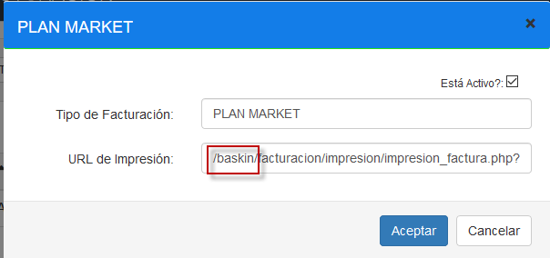

 ### 2.4 Cambio de formas de pago

Posteriormente ubicamos en el menú la definición de formas de pago
 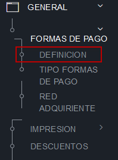

Debemos buscar la configuración de tarjetas y cambiar el texto POS por la cadena que se está configurando
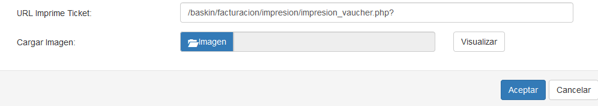
