# Manual de Usuario - Instalación de Reportes KFC

**Instalación de Reportes**
**Desarrollo de Software y Proyectos**

**Script para instalación de Reportes en los Servidores KFC**

## Descripción

En este documento se explica el procedimiento necesario para realizar la instalación de los reportes del sistema MAXPOINT en las tiendas  correspondientes al grupo KFC.
La instalación se realiza ejecutando un script que se encarga de copiar los reportes y datasources desde un servidor  de Reporting Services de origen hacia un servidor de Reporting Services de destino.

## Procedimiento

Lo primero que se debe hacer es buscar las direcciones de los endpoints del servicio de Reporting services, mismos que se encuentran en el programa de configuración de Reporting Services.

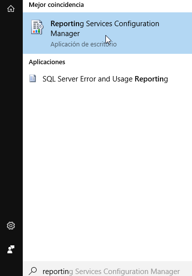

Una vez abierto el programa presionamos la pestaña **WEB Service URL**, se nos mostrará la siguiente pantalla:

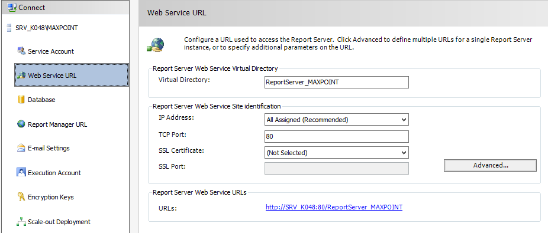

Esta dirección es la que vamos a utilizar luego para realizar la migración, y debemos buscarla tanto en el servidor de origen de los reportes como en el servidor de destino.

         Esta URL varía  en cada local

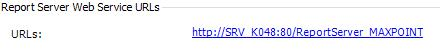

 Una vez que tenemos ambas direcciones debemos abrir en el servidor de origen la carpeta que
contiene los scripts.

 Dentro de la misma se encuentra el archivo migrar.bat, mismo que puede ser editado con
cualquier editor de texto plano, en este caso Notepad++

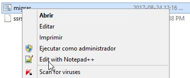

El archivo es una única línea de código con la siguiente estructura:

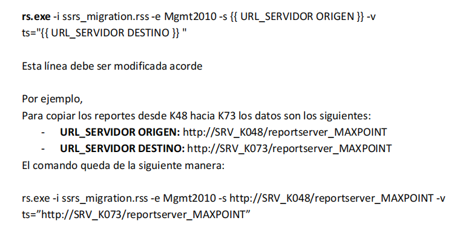

Guardamos el archivo y lo siguiente es abrir una consola de comandos en la carpeta de scripts. Luego ejecutamos el archivo migrar.bat

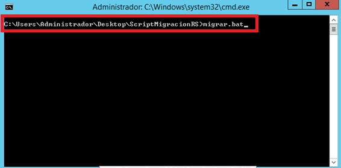

Nota: en este caso, nuestra carpeta que contiene los scripts se encuentra en el escritorio, por este motivo como podemos observar en la dirección.  

 

El Script se encargará de realizar una copia exacta en el servidor de destino tanto de los
Reportes como de los Data Sources instalada en el servidor de origen.

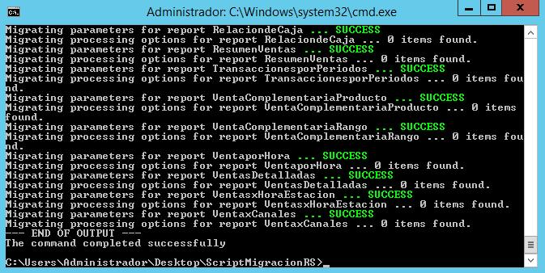

Para verificar que se han migrado los reportes podemos entrar a la pantalla de administración
de Reporting Services en el servidor de destino. Allí encontraremos Todo ya correctamente
migrado:

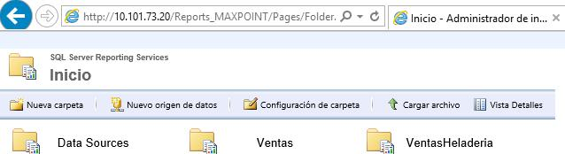
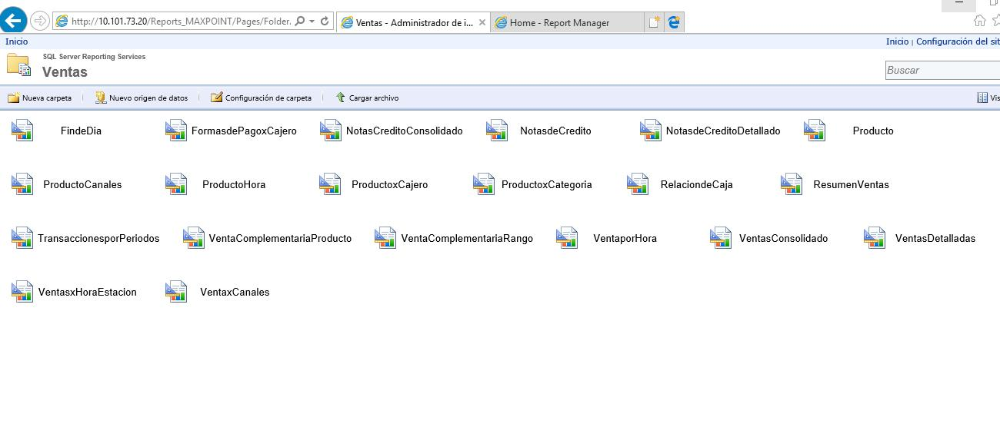

El siguiente paso a seguir es el procedimiento de reconfiguración de los datos de conexión del o (los) Data Sources que se crearon, ya que al migrarse se pasan con los datos del servidor de origen. 

Para ello ingresamos a cada uno de los Data Sources haciendo click sobre el mismo.

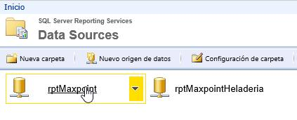

Colocamos los datos de conexión correspondientes al local que estamos configurando

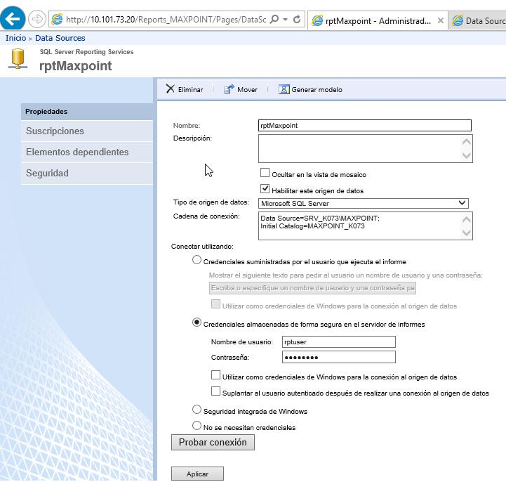

Nota: La clave para el usuario rptuser debe ser consultada al administrador al momento de realizar la migración.   

**Resolución de Problemas:**

En general los problemas con este procedimiento suceden por 2 razones:

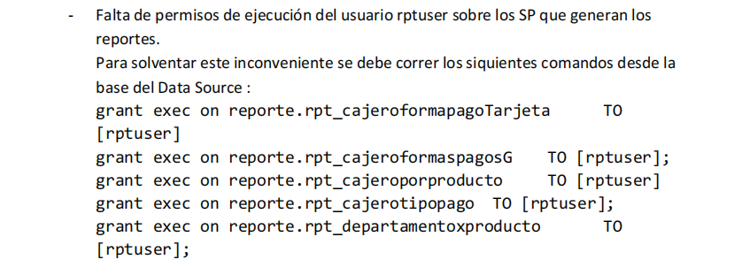
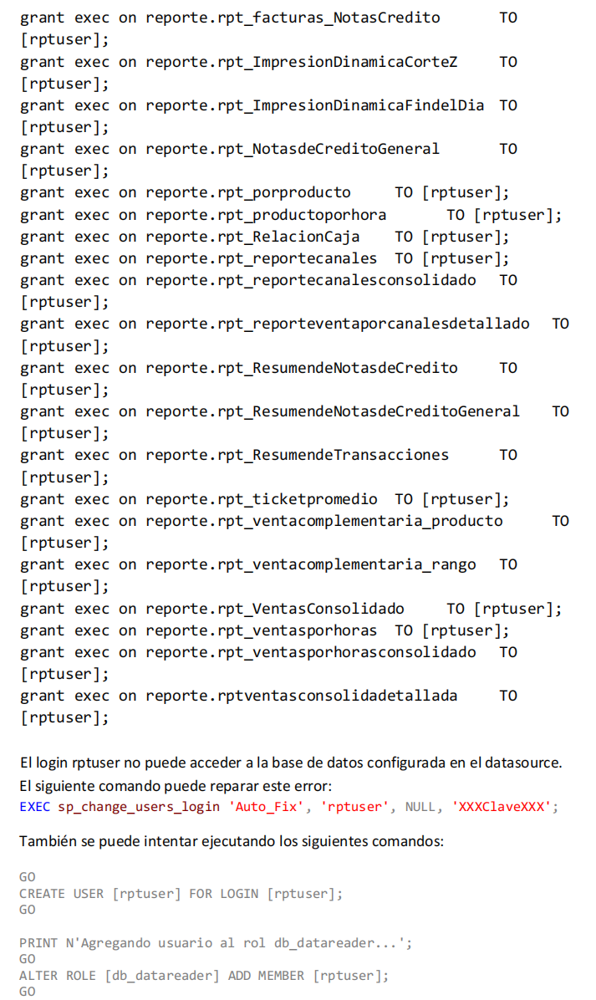

 Como último paso y por seguridad se deberá realizar una prueba de los reportes, una vez realizada las configuraciones anteriormente dichas. Para que de este modo no evitar cualquier tipo de error. 

